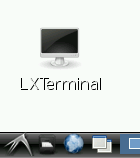
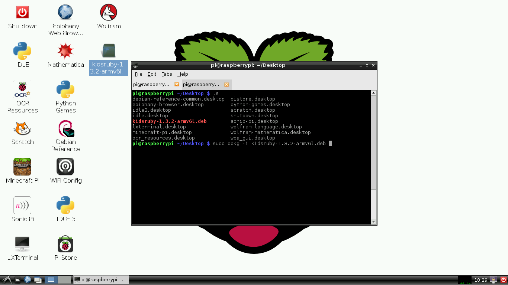
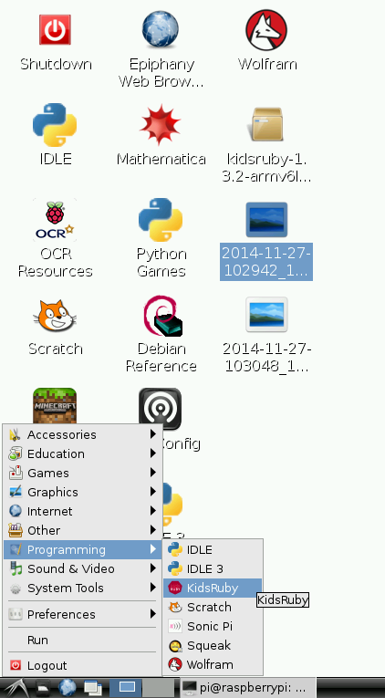
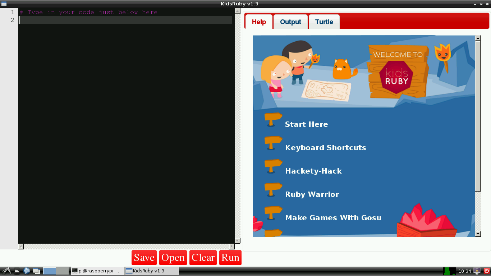

# Software installation

You'll need to make sure you have the following packages installed to proceed with the workshop.

You'll need to be online to install packages.

To use Ruby on your Raspberry Pi we will need to install a special version called "Kids Ruby". This version is ideally suited for this project and it can be installed really quickly.
To install Kids Ruby on your Raspberry Pi you will need to open a terminal, you can do this by double left clicking on the LXTerminal icon that is on your desktop.



To download the file for installation on your Raspberry Pi type the following into the terminal

```Bash
wget https://s3.amazonaws.com/kidsruby/raspbian/kidsruby-1.3.2-armv6l.deb
```
Once downloaded keep the terminal window open and type in the following
```Bash
sudo dpkg -i kidsruby-1.3.2-armv6l.deb
```


This will install Kids Ruby on to your Raspberry Pi. Once it has been installed it will be available via the Programming menu.



Launch the Kids Ruby application by selecting it from the menu, in a few seconds the application will be ready to use.



Kids Ruby uses a simple layout with the screen split into two large sections.

- A large black box, where our Ruby code is typed
- A large box with shortcuts to built in ideas and projects, as well as the output from any code that is written.

Underneath the large black box are a few buttons.

- Save: Saves your project, it's really important to save your work regularly.
- Open: Opens a project that has been saved to your computer.
- Clear: Clears the code in the black box, use with caution.
- Run: Runs the code in the black box.
